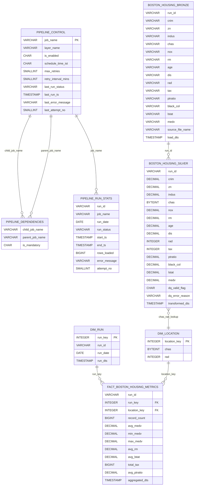

# ER Diagram

```mermaid
erDiagram
    PIPELINE_CONTROL {
        VARCHAR job_name PK
        VARCHAR layer_name
        CHAR is_enabled
        CHAR schedule_time_ist
        SMALLINT max_retries
        SMALLINT retry_interval_mins
        VARCHAR last_run_status
        TIMESTAMP last_run_ts
        VARCHAR last_error_message
        SMALLINT last_attempt_no
    }

    PIPELINE_DEPENDENCIES {
        VARCHAR child_job_name
        VARCHAR parent_job_name
        CHAR is_mandatory
    }

    PIPELINE_RUN_STATS {
        VARCHAR run_id
        VARCHAR job_name
        DATE run_date
        VARCHAR run_status
        TIMESTAMP start_ts
        TIMESTAMP end_ts
        BIGINT rows_loaded
        VARCHAR error_message
        SMALLINT attempt_no
    }

    BOSTON_HOUSING_BRONZE {
        VARCHAR run_id
        VARCHAR crim
        VARCHAR zn
        VARCHAR indus
        VARCHAR chas
        VARCHAR nox
        VARCHAR rm
        VARCHAR age
        VARCHAR dis
        VARCHAR rad
        VARCHAR tax
        VARCHAR ptratio
        VARCHAR black_col
        VARCHAR lstat
        VARCHAR medv
        VARCHAR source_file_name
        TIMESTAMP load_dts
    }

    BOSTON_HOUSING_SILVER {
        VARCHAR run_id
        DECIMAL crim
        DECIMAL zn
        DECIMAL indus
        BYTEINT chas
        DECIMAL nox
        DECIMAL rm
        DECIMAL age
        DECIMAL dis
        INTEGER rad
        INTEGER tax
        DECIMAL ptratio
        DECIMAL black_col
        DECIMAL lstat
        DECIMAL medv
        CHAR dq_valid_flag
        VARCHAR dq_error_reason
        TIMESTAMP transformed_dts
    }

    DIM_RUN {
        INTEGER run_key PK
        VARCHAR run_id
        DATE run_date
        TIMESTAMP run_dts
    }

    DIM_LOCATION {
        INTEGER location_key PK
        BYTEINT chas
        INTEGER rad
    }

    FACT_BOSTON_HOUSING_METRICS {
        VARCHAR run_id
        INTEGER run_key FK
        INTEGER location_key FK
        BIGINT record_count
        DECIMAL avg_medv
        DECIMAL min_medv
        DECIMAL max_medv
        DECIMAL avg_rm
        DECIMAL avg_lstat
        BIGINT total_tax
        DECIMAL avg_ptratio
        TIMESTAMP aggregated_dts
    }

    PIPELINE_CONTROL ||--o{ PIPELINE_RUN_STATS : job_name
    PIPELINE_CONTROL ||--o{ PIPELINE_DEPENDENCIES : child_job_name
    PIPELINE_CONTROL ||--o{ PIPELINE_DEPENDENCIES : parent_job_name

    BOSTON_HOUSING_BRONZE ||--o{ BOSTON_HOUSING_SILVER : run_id
    BOSTON_HOUSING_SILVER }o--|| DIM_LOCATION : chas_rad_lookup
    DIM_RUN ||--o{ FACT_BOSTON_HOUSING_METRICS : run_key
    DIM_LOCATION ||--o{ FACT_BOSTON_HOUSING_METRICS : location_key
```
